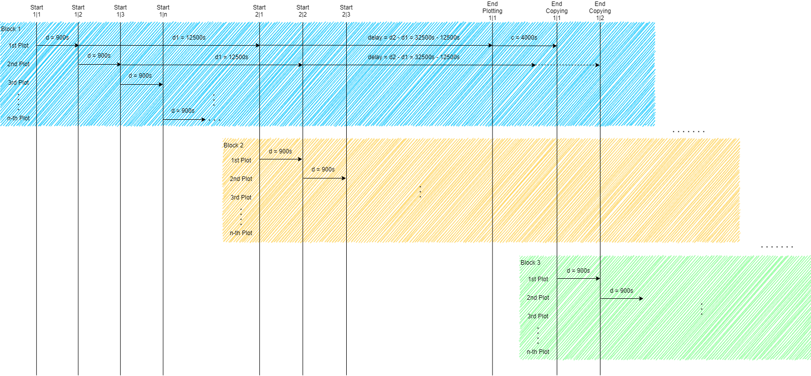

# Chia Automated Parallel Plotter - CAPP

This project was initiated by Chia Farming via CLI.

The python program should improve the handling with the CLI and automate the plotting process.

This program addresses four main problems which occured via plotting parallel via CLI

* Delays between plots
* Multiple temporary devices
* Multiple target devices
* Endless plotting process repected to resources

The use case was that I'd like to plot automated on a small server system with multiple SSDs and multiple HDDs. I've started
to determine the times of the different plotting phases. It is needed find the time of phase 1 and the time of the whole
plotting process. Based on these times it is possible to set up an automated endless plotting process with optimal output.

## Description of the automated endless plotting process


The program starts first e.g. 6 plots parallel and after phase 1 of these plots is finished, it starts an other 6 parallel
plots. Each plot is executed in its own thread. After the first plots are finished the threads will be closed and an
other 6 plots were triggered and so on.

## Preliminary
* Install Python 3.8
* Setup Chia environment variable
* Evaluate the times of your plotting process
* Start CAPP

```
    python capp.py -k 32 -n 1 -b 3390 -r 2 -t Y;Z -f V -d1 12500 -d2 34000 -d 900 -a 6
```

## Parameters



|Parameter |Description |Example |
| --- | --- | --- |
|k |Plotsize |-k 32 (default: 32) |
|n |Amount of plots in queue |-n 1 (default: 1) |
|b |Amount of RAM in MB |-n 3390 (default: 3390) |
|r |Amount of Threads |-r 2 (default: 2) |
|t |Temporary devices separated with ; |-t A;B |
|f |Final target devices separated with ; |-f C |
|d1 |Delay 1 which corresponds with the Phase 1 time in seconds |-d1 12500 |
|d2 |Delay 2 which corresponds with Plotting time in seconds |-d2 32000 |
|d |Distance is the time between each plot starts |-d 900 (default: 900) |
|a |Amount of parallel plots per temporary drive (e.g. 2TB NVME 6-7 plots parallel) |-a 6 |
|m |If you want to farm on a remote machine set to True |-m True (default: False) |
|fk |Your farmer key from your main machine |-fk 870g238748a0193l27v482s93047283402d3914n728394 |
|pk |Your pool key from your main machine |-pk 67573418920hd37482017348a0j2937489k2134701o2 |